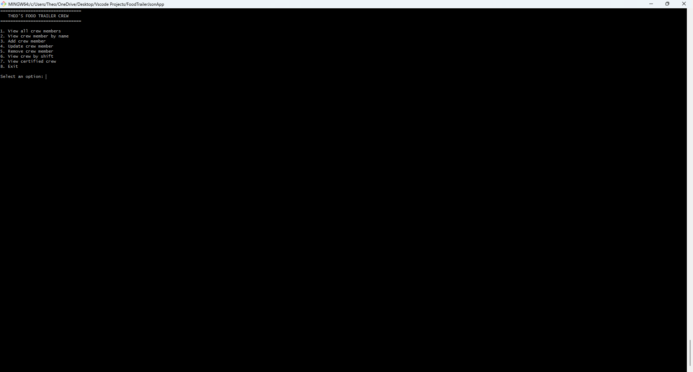
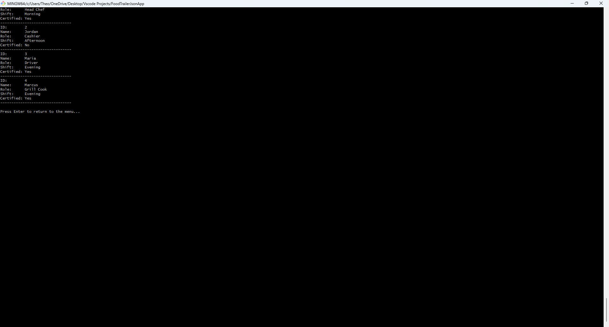

# Theo's Food Trailer Crew Management App

A **C# and .NET 10 console application** for managing food trailer crew members.

This project demonstrates practical software development concepts including **object-oriented programming, CRUD operations, JSON data persistence, LINQ, service-based architecture, automated testing with xUnit, and Git/GitHub version control**.

---

## Features

- View all crew members
- Search for a crew member by name
- Add new crew members
- Update existing crew members
- Remove crew members
- Filter crew members by shift
- View certified crew members
- Automatically assign IDs to new crew members
- Save crew information to JSON
- Load saved crew information from JSON
- Automated unit testing with xUnit

---

## Application Screenshots

### Main Menu

The console interface provides access to the application's crew-management features.



### Crew Member List

Crew information is loaded from the JSON data store and displayed through the console application.



---

## CRUD Operations

The application implements the four primary CRUD operations:

| CRUD Operation | Application Feature |
| --- | --- |
| **Create** | Add a new crew member |
| **Read** | View all crew, search by name, filter by shift, and view certified crew |
| **Update** | Modify an existing crew member |
| **Delete** | Remove a crew member |

---

## Technologies Used

| Technology | Purpose |
| --- | --- |
| C# | Primary programming language |
| .NET 10 | Application framework |
| System.Text.Json | JSON serialization and deserialization |
| LINQ | Searching and filtering crew data |
| xUnit | Automated unit testing |
| Git | Version control |
| GitHub | Repository hosting |
| Visual Studio Code | Development environment |

---

## Project Structure

```text
FoodTrailerJsonApp/
│
├── Data/
│   └── crew.json
│
├── Models/
│   └── CrewMember.cs
│
├── Services/
│   └── CrewService.cs
│
├── FoodTrailerJsonApp.Tests/
│   ├── CrewServiceTest.cs
│   └── FoodTrailerJsonApp.Tests.csproj
│
├── images/
│   ├── crew-list.png
│   └── main-menu.png
│
├── Program.cs
├── FoodTrailerJsonApp.csproj
├── FoodTrailerJsonApp.sln
├── .gitignore
└── README.md
```

---

## Application Architecture

The project separates the application into models, services, data, testing, and the console user interface.

### Model

`Models/CrewMember.cs` represents an individual food trailer crew member.

Each crew member contains:

- ID
- Name
- Role
- Shift
- Certification status

Example:

```csharp
public class CrewMember
{
    public int Id { get; set; }

    public string Name { get; set; } = string.Empty;

    public string Role { get; set; } = string.Empty;

    public string Shift { get; set; } = string.Empty;

    public bool Certified { get; set; }
}
```

### Service Layer

`Services/CrewService.cs` contains the application's crew-management and data-access logic.

The service is responsible for:

- Loading crew members
- Saving crew members
- Searching by name
- Searching by ID
- Adding crew members
- Updating crew members
- Removing crew members
- Filtering crew by shift
- Retrieving certified crew members

Keeping this logic inside a service class helps separate the application's business logic from the console user interface.

### JSON Data

Crew information is stored in:

```text
Data/crew.json
```

The application uses `System.Text.Json` to serialize C# objects into JSON and deserialize JSON back into C# objects.

This allows changes to crew information to remain available after the application closes.

### Console Interface

`Program.cs` provides the user interface for interacting with the application.

The main menu allows users to select different crew-management operations.

---

## Main Menu

```text
================================
   THEO'S FOOD TRAILER CREW
================================

1. View all crew members
2. View crew member by name
3. Add crew member
4. Update crew member
5. Remove crew member
6. View crew by shift
7. View certified crew
8. Exit
```

---

## Automated Testing

The solution contains a separate xUnit test project:

```text
FoodTrailerJsonApp.Tests
```

The tests focus on the `CrewService` and use temporary JSON files so the real application data is not modified during testing.

### Current Tests

The test suite verifies that:

1. A missing JSON file returns an empty crew list
2. Adding a crew member assigns an ID and saves the member
3. A crew member can be found by ID
4. Name searches are case-insensitive
5. Existing crew information can be updated
6. Existing crew members can be removed
7. Crew members can be filtered by shift
8. Only certified crew members are returned by the certification filter

### Current Test Results

```text
Test summary: total: 8, failed: 0, succeeded: 8, skipped: 0
```

---

## Getting Started

### Prerequisites

Install the .NET SDK.

Verify your installation:

```bash
dotnet --version
```

---

## Clone the Repository

```bash
git clone https://github.com/tabner0320/FoodTrailerJsonApp.git
```

Navigate into the project:

```bash
cd FoodTrailerJsonApp
```

---

## Run the Application

From the project directory, run:

```bash
dotnet run
```

The console menu will appear and allow you to manage the food trailer crew.

---

## Run the Tests

Run the xUnit test project with:

```bash
dotnet test FoodTrailerJsonApp.Tests/FoodTrailerJsonApp.Tests.csproj
```

A successful test run should report:

```text
total: 8
failed: 0
succeeded: 8
skipped: 0
```

---

## Key Concepts Demonstrated

This project demonstrates several core C# and software-development concepts:

- Classes and objects
- Properties
- Methods
- Object-oriented programming
- Separation of concerns
- Service classes
- Collections with `List<T>`
- LINQ
- File handling
- JSON serialization
- JSON deserialization
- CRUD operations
- String comparison
- Automated unit testing
- Test isolation
- Git version control
- GitHub repository management

---

## What I Learned

Building this project strengthened my understanding of how a C# application can be organized beyond putting all functionality into a single file.

I practiced separating responsibilities between models, services, data, tests, and the console interface. I also gained additional experience implementing CRUD operations, working with JSON files, querying collections with LINQ, and creating automated tests with xUnit.

The project also provided practical experience using Git and GitHub to manage commits, synchronize branches, resolve rebase issues, and maintain a clean repository.

---

## Portfolio Summary

**Theo's Food Trailer Crew Management App** demonstrates my ability to build and organize a C#/.NET application that includes:

- A structured object-oriented design
- Full CRUD functionality
- Persistent JSON data storage
- LINQ-based searching and filtering
- Separation of application responsibilities
- Automated xUnit testing
- Git and GitHub version control

The project started as a JSON-based console application and was expanded into a more structured, testable, and maintainable .NET application.

---

## Author

**Theophilus M. Abner Jr.**

GitHub: [@tabner0320](https://github.com/tabner0320)